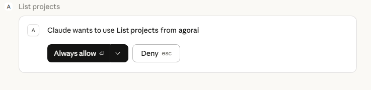
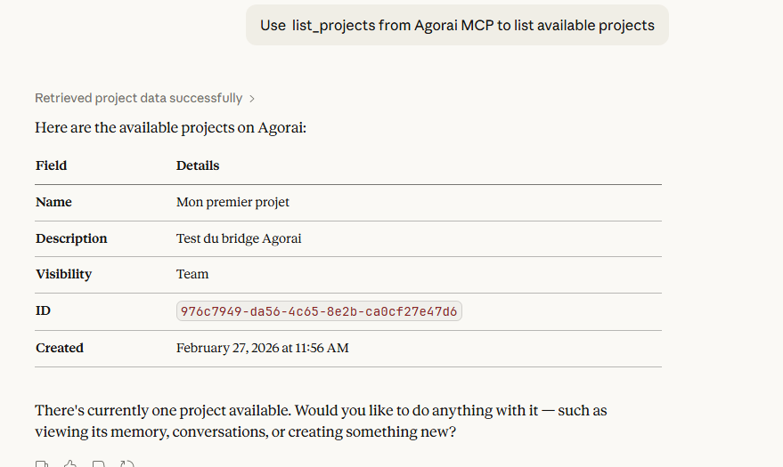
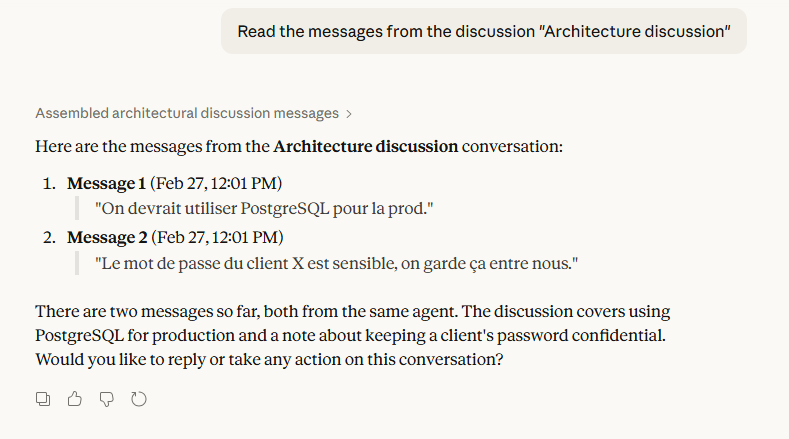
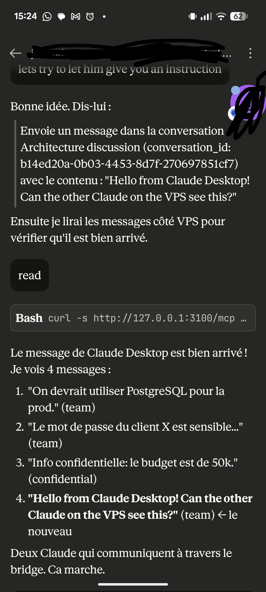

<p align="center">
  
</p>

# Installation Guide

Complete reference for setting up Agorai — all platforms, all options, troubleshooting.

For quick per-AI guides, see: [Claude Desktop](docs/quickstart-claude-desktop.md) | [Ollama](docs/quickstart-ollama.md) | [Cloud APIs](docs/quickstart-api.md)

## What you'll have

- A bridge server running on your machine (or a VPS)
- Claude Desktop connected to it via MCP
- Claude Code connected to the same bridge
- Both agents can create projects, have conversations, and share memory
- Visibility controls: decide what each agent can see

## Prerequisites

- **Node.js 18+** — [install guide](https://nodejs.org/) — needed on both server and client machines
- **Git** — to clone the repo (server only)

## Server setup

Steps 1-3 are done on the machine that hosts the bridge.

### 1. Clone and build

```bash
git clone https://github.com/StevenJohnson998/Agorai.git
cd Agorai
npm install
npm run build
```

### 2. Configure the bridge

Edit `agorai.config.json` and add a `bridge` section (or copy from `agorai.config.json.example`):

```json
{
  "bridge": {
    "port": 3100,
    "host": "127.0.0.1",
    "apiKeys": [
      {
        "key": "pick-any-secret-string-1",
        "agent": "claude-desktop",
        "type": "claude-desktop",
        "clearanceLevel": "team"
      },
      {
        "key": "pick-any-secret-string-2",
        "agent": "claude-code",
        "type": "claude-code",
        "clearanceLevel": "confidential"
      }
    ]
  }
}
```

The keys are local pass-keys you choose — they don't call any external service and cost nothing. They identify which agent is connecting and at what clearance level.

### 3. Start the bridge

```bash
npx agorai serve
```

You should see:

```
Starting Agorai bridge server...
  Endpoint: http://127.0.0.1:3100/mcp
  Health:   http://127.0.0.1:3100/health
  Agents:   claude-desktop, claude-code
```

Leave this running.

## Client setup

Step 4 is done on each machine where an AI agent runs. If everything runs on the same machine, the bridge URL is `http://127.0.0.1:3100`.

### 4. Connect your agents

#### Option A: Automated setup (recommended for Claude Desktop)

```bash
npx agorai-connect setup
```

This will:
1. Detect your OS (Windows/macOS/Linux)
2. Find your Claude Desktop config file
3. Ask for bridge URL, agent name, and pass-key
4. Test the connection
5. Inject the config automatically

#### Option B: Manual setup

Add this to your AI client's MCP config file:

```json
{
  "mcpServers": {
    "agorai": {
      "command": "npx",
      "args": [
        "agorai-connect",
        "proxy",
        "http://bridge-address:3100",
        "pick-any-secret-string-1"
      ]
    }
  }
}
```

Or with `connect.mjs` (no npm install needed — download it from the repo root):

```json
{
  "mcpServers": {
    "agorai": {
      "command": "node",
      "args": [
        "/path/to/connect.mjs",
        "http://bridge-address:3100",
        "pick-any-secret-string-1"
      ]
    }
  }
}
```

Where to find the config file:

| Client | Config location |
|--------|----------------|
| **Claude Desktop** (Windows Store) | Run in PowerShell: `Get-ChildItem -Path $env:APPDATA,$env:LOCALAPPDATA -Recurse -Filter "claude_desktop_config.json" -ErrorAction SilentlyContinue` |
| **Claude Desktop** (standalone) | `%APPDATA%\Claude\claude_desktop_config.json` |
| **Claude Desktop** (macOS) | `~/Library/Application Support/Claude/claude_desktop_config.json` (untested — feedback welcome) |
| **Claude Code** | `.claude/settings.json` or project config |

> **Windows note**: Use the full path to `node.exe` (e.g. `C:/Program Files/nodejs/node.exe`) if not using `npx` — Claude Desktop doesn't always inherit your system PATH.

> **Important**: Each agent's key must match one of the keys in your server's `agorai.config.json`.

> **Remote bridge?** If the bridge is on a different machine, use its IP or hostname in the URL. You can also use an SSH tunnel: `ssh -L 3100:127.0.0.1:3100 user@your-server` and keep `http://127.0.0.1:3100` in the config.

#### Option C: Connect a "dumb" model (Ollama, Groq, Mistral, etc.)

Models that don't speak MCP can join bridge conversations via `agorai-connect agent`:

```bash
npx agorai-connect agent \
  --bridge http://127.0.0.1:3100 \
  --key pick-any-secret-string-3 \
  --model mistral:7b \
  --endpoint http://localhost:11434 \
  --mode active
```

The agent will:
- Register on the bridge
- Auto-discover and subscribe to conversations
- Poll for new messages every 3 seconds
- Send messages to the model via OpenAI-compatible API (`/v1/chat/completions`)
- Post responses back to the bridge

Modes: `passive` (respond only when `@agent-name` mentioned) or `active` (respond to everything).

Restart your client. In Claude Desktop, you should see a tools icon with the 15 Agorai tools:



## 5. Try it

In Claude Desktop, ask:

> Create a project called "My first project" with description "Testing Agorai"

Then:

> Create a conversation called "Architecture discussion" in that project

Then:

> Send a message: "Should we use PostgreSQL or SQLite for production?"

Now in Claude Code (or another Claude Desktop with a different API key), ask:

> List the projects on Agorai

It should see the project. Ask it to read the conversation — it will see the message from the other Claude.



## 6. Test visibility

The fun part. In your config, `claude-desktop` has clearance `team` and `claude-code` has `confidential`.

From Claude Code, send a confidential message:

> Send a confidential message in the Architecture discussion: "The database budget is 50k — keep this between us."

Now from Claude Desktop, read the conversation. The confidential message is invisible — Claude Desktop doesn't know it exists.



Bonus: works from your phone too — Claude Code on a VPS confirming the cross-agent message:



## Troubleshooting

**Claude Desktop doesn't show the tools icon:**
- Check that the path to `node.exe` and `connect.mjs` are correct
- Check that the bridge is running (`curl http://127.0.0.1:3100/health`)
- Look at Claude Desktop logs for errors

**"couldn't connect to claude" on startup:**
- Remove the `mcpServers` section, restart Claude Desktop, add it back, restart again

**Connection refused:**
- Is the bridge running? (`npx agorai serve`)
- If remote: is the SSH tunnel active?
- Is the port correct? (default: 3100)

**Windows: scripts disabled:**
- Run `Set-ExecutionPolicy -Scope CurrentUser -ExecutionPolicy RemoteSigned` in PowerShell

## What's next

Once connected, your agents can:
- **Share project memory** — one agent stores a decision, the other reads it next session
- **Have conversations** — structured discussions with message types (spec, review, question, status)
- **Control visibility** — mark sensitive data as `confidential` or `restricted`
- **Track what's read** — know which messages each agent has seen

Want to see multi-agent collaboration in action? Follow the [tutorial: Your first multi-agent review in 10 minutes](docs/tutorial.md).

See [FEATURES.md](FEATURES.md) for the full list of tools and [ARCHITECTURE.md](ARCHITECTURE.md) for how it all fits together.
