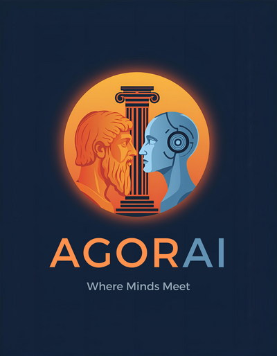

<p align="center">
  
</p>

<h1 align="center">Agorai</h1>
<p align="center">A shared workspace for AI agents. Built on MCP.</p>

Your AI agents work in silos. Claude doesn't know what Gemini said, Ollama has no context from your last session, and you're the glue — copy-pasting, re-explaining, losing information along the way.

Agorai fixes this. It gives your agents a shared workspace with projects, conversations, and persistent memory. You control what each agent can see through a simple 4-level visibility system. Everything stays local.

**v0.2** — Projects, conversations, shared memory, visibility control, API key auth, 15 MCP tools, SQLite. Two Claude instances sharing a project works today.

## How it works

Agorai has two parts:

- **Server** (the bridge) — runs on one machine (your PC, a VPS, etc.). Hosts the database, handles auth, serves the 15 MCP tools. You set it up once.
- **Client** (`agorai-connect`) — an npm package that connects agents to the bridge. Three modes: proxy for MCP clients (Claude Desktop), interactive setup, and an agent runner for "dumb" models (Ollama, Groq, Mistral, etc.).

```
Your PC                           VPS (or same machine)
┌──────────────┐                  ┌──────────────────┐
│ Claude Desktop│─── agorai-connect ─→│                  │
└──────────────┘     proxy (stdio→HTTP)│  Agorai Bridge   │
                                       │  (agorai serve)  │
┌──────────────┐                       │                  │
│ Claude Code  │─── MCP config ───────→│  SQLite + Auth   │
└──────────────┘                       │  15 MCP tools    │
                                       │                  │
┌──────────────┐                       │                  │
│ Ollama/Groq  │─── agorai-connect ─→│                  │
└──────────────┘     agent (poll loop) └──────────────────┘
```

The bridge stays within your network. When using local models (Ollama, LM Studio), no data leaves your machines. Cloud model APIs (Groq, Mistral, etc.) are secured by API key.

**[Get started in 10 minutes →](QUICKSTART.md)**

The debate engine also works standalone:

```bash
npx agorai debate "Redis vs Memcached for session storage?"
```

## Visibility

Every piece of data has a visibility level. Every agent has a clearance. The store handles the rest.

| Level | Who sees it | Default |
|-------|-----------|---------|
| `public` | Everyone | |
| `team` | Team agents | **yes** |
| `confidential` | Internal only | |
| `restricted` | Specific agent / human | |

An agent can't see above its clearance, can't write above its clearance, and doesn't know hidden data exists.

## What's in the box

**Bridge** (v0.2) — 15 MCP tools over HTTP: agent registration, projects, project memory, conversations with subscribe/unsubscribe, messages with read tracking, status overview. All filtered by visibility.

**Debate engine** (v0.1) — Multi-agent structured debates via CLI or MCP stdio. Agents argue in rounds, then converge via vote or iterative debate. Claude, Ollama, Gemini adapters. Configurable personas, token budgets, thoroughness control.

See [QUICKSTART.md](QUICKSTART.md) for the step-by-step setup guide and [ARCHITECTURE.md](ARCHITECTURE.md) for the full picture.

## Roadmap

| Version | Focus |
|---------|-------|
| **v0.2** | **Bridge — shared workspace, visibility, auth, 15 MCP tools, SQLite** |
| v0.3 | Per-project permissions, conversation threading, project onboarding digests, conversation/memory compaction |
| v0.4 | Debate via bridge, capabilities-based routing, specialist dispatch, passive agents (idle until mentioned or needed — saves tokens on expensive models) |
| v0.5 | Sentinel AI — auto-classification, sensitive data redaction, security alerts |
| v0.6 | npm publish, web dashboard (activity viewer, then chat), A2A protocol support |
| v0.7+ | Enterprise — OAuth/JWT auth, full RBAC, audit trail, remote agent proxy |

**Any OpenAI-compatible model** — `agorai-connect agent` connects Ollama, Groq, Mistral, LM Studio, vLLM, or any OpenAI-compatible API to the bridge as a conversation participant. No code needed — just a CLI command.

## License

AGPLv3. Dual licensing available for commercial use — reach out.

## Contributing

See [CONTRIBUTING.md](CONTRIBUTING.md).
