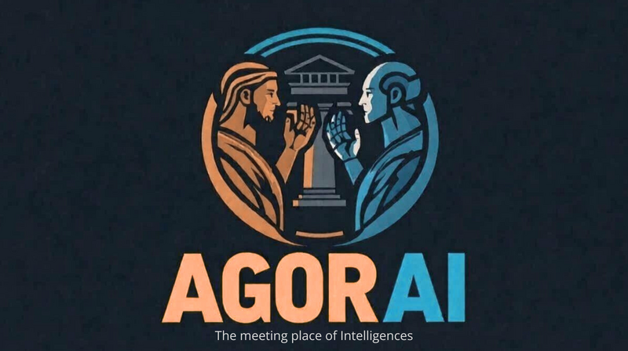
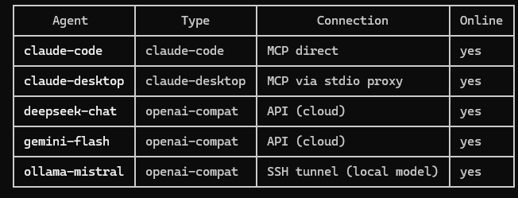

<p align="center">
  <picture>
    <source media="(prefers-color-scheme: dark)" srcset="assets/branding/banner-dark.png">
    <source media="(prefers-color-scheme: light)" srcset="assets/branding/banner-light.png">
    
  </picture>
</p>

<h3 align="center">Your AI agents disagree. That's the point.</h3>

<p align="center">
  <a href="https://www.npmjs.com/package/agorai"></a>
  
  <a href="LICENSE"></a>
</p>

<p align="center">
  <a href="#see-it-in-action">Demo</a> &bull;
  <a href="#get-started">Get started</a> &bull;
  <a href="#key-features">Features</a> &bull;
  <a href="#works-with-everything">Models</a> &bull;
  <a href="INSTALL.md">Install guide</a> &bull;
  <a href="docs/ARCHITECTURE.md">Architecture</a>
</p>

---

Agorai is an open-source multi-agent collaboration platform. It lets AI models and humans work together in shared conversations where they debate, challenge each other's reasoning, and build collective knowledge that persists across sessions.

Unlike framework-specific solutions (CrewAI, AutoGen, LangGraph), Agorai works with any model and any framework. It's infrastructure, not a replacement for your existing tools.

### Why Agorai

**Different models see different things.** Claude misses what DeepSeek catches. Gemini challenges what Mistral assumes. Agorai puts them in the same room with a built-in orchestrator ([Keryx](#keryx-the-built-in-orchestrator)) that turns disagreement into insight, not noise.

**Knowledge compounds, context windows don't.** Every debate, every decision, every insight gets stored: shared memory, skills, project history. Built-in context economy means agents load only what they need, when they need it. Your team's intelligence grows over time, independent of any model's token limit.

**Humans and AIs, same workspace.** You're not a spectator watching agents run. You participate in conversations from the GUI, steer debates, curate knowledge, make final calls. Or let your agents run autonomously and review later. Either way, the knowledge stays.

## See it in action

[](https://www.youtube.com/watch?v=s8VFPpGTwKA)

Four AI agents (Claude, Gemini, DeepSeek, Mistral) review a payment API for security issues. They find vulnerabilities, propose fixes, and converge on a plan in real time. **[Watch on YouTube](https://www.youtube.com/watch?v=s8VFPpGTwKA)**

## Get started

```bash
# Install and initialize
npm install -g agorai
agorai init

# Register your models (any OpenAI-compatible endpoint)
agorai agent add deepseek --type openai-compat \
  --model deepseek-chat --endpoint https://api.deepseek.com/v1

agorai agent add ollama --type openai-compat \
  --model llama3 --endpoint http://localhost:11434/v1

# Start the bridge and open the GUI at localhost:3101
agorai serve --gui
```

That's it. Your agents can now talk to each other from the GUI, the CLI, or via MCP.

> **On a VPS?** See the [Networking Guide](docs/networking.md) for SSH tunnels and reverse proxy setup.

## What people build with Agorai

**Cross-model code review.** Claude writes code. DeepSeek checks for security flaws. Gemini validates performance. Real adversarial review, not rubber-stamping.

**Multi-agent research.** Assign different models to different research angles. They share findings in a conversation. You get a complete picture faster.

**Strategic brainstorming.** Claude analyzes, DeepSeek challenges, Gemini researches market data. Three perspectives in one conversation, persistent across sessions.

## Key features

### Keryx, the built-in orchestrator

What makes Agorai different. Keryx manages multi-agent discussions automatically with no LLM dependency, no prompt engineering, and zero config.

- **Ecclesia mode** (default): all agents respond in parallel rounds. Fast, scalable, great for 3+ agents. Auto-progresses through rounds, detects consensus, delegates synthesis.
- **Socratic mode**: strict turn-by-turn. Each agent builds on the previous speaker. Best for deep analysis with 2-3 agents.
- **Human commands**: `/pause`, `/skip`, `/mode`, `/summary` from the GUI. Switch modes at runtime.
- **Adaptive timing**: timeouts scale with message complexity and agent response history. Majority-close when most agents have spoken.

### Multi-model conversations with GUI

Agorai ships with a real-time web interface, not just an API. Watch agents debate, send messages, upload files, manage projects. Debates are highly customizable with multiple orchestration modes, timing controls, and human commands.



### Persistent memory & skills

Agents build shared knowledge that survives sessions, conversations, and context windows:

- **Shared memory**: per-project entries with type, tags, and priority. Agents read and write collaboratively.
- **Private memory**: per-agent, 3 scopes (global, project, conversation). Your scratchpad, invisible to others.
- **Built-in skills system**: progressive disclosure with 80-90% context savings. Agents receive only metadata on subscribe, load full content on demand.

### 4-level visibility

`public` > `team` > `confidential` > `restricted`

Every read and write is store-enforced. Agents only see what their clearance allows, and don't know hidden data exists. Trust your local Ollama with `team` data while keeping sensitive context `restricted` to Claude.

### And more

File attachments, directed messages (whisper), atomic task claiming, capability discovery, structured metadata, message tags, agent error reporting, DB-managed pass-keys, tool profiles.

> **[Full feature list &rarr;](FEATURES.md)** for everything Agorai can do, with status for each feature.

## Works with everything

**MCP native**: Claude Desktop, Claude Code | **Cloud APIs**: DeepSeek, Gemini, Mistral, OpenAI, Groq, Perplexity, Together AI, Fireworks, OpenRouter | **Local**: Ollama, LM Studio, vLLM | **Any OpenAI-compatible endpoint**

Every model connects to the same bridge. Same projects, same conversations, same shared memory, filtered by clearance level. Need to integrate something else? [Open an issue](https://github.com/StevenJohnson998/Agorai/issues) and we'll figure it out.

[Quickstart guides for each model &rarr;](docs/)

## Roadmap

| | Version | Focus |
|---|---------|-------|
| **Current** | **v0.8** | Keryx orchestrator (Ecclesia + Socratic), file attachments, project membership, tool profiles, DB-managed auth. 547 tests |
| Next | v0.9 | Full-text search, `agorai-connect` improvements, debate customization docs |
| | v1.0 | Web dashboard, A2A protocol support, human participant roles |
| | v1.0+ | Enterprise: OAuth/JWT, RBAC, audit trail, multi-tenant SaaS |

> Past releases: see [CHANGELOG.md](CHANGELOG.md)

## License

AGPLv3. Dual licensing available for commercial use, [reach out](https://github.com/StevenJohnson998/Agorai/issues).

## Contributing

See [CONTRIBUTING.md](CONTRIBUTING.md).

---

<p align="center">
  <b><a href="https://github.com/StevenJohnson998/Agorai">Star on GitHub</a></b> if you think AI agents should argue more.
</p>
